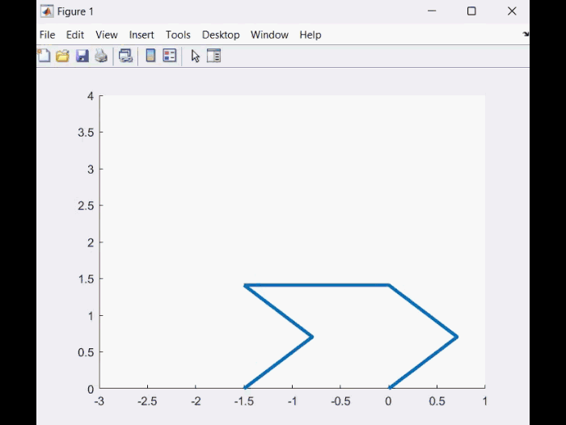
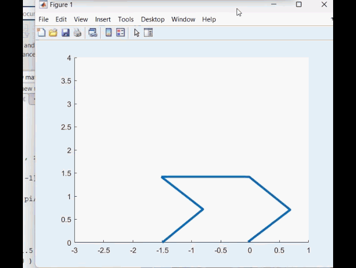

# quadruped-robot-simulation-and-design
This MATLAB code simulates the walking motion of a quadruped robot based on a trajectory that is solved from an equation using the `fsolve` function. The trajectory is derived from the kinematics of the robot.

## Overview

This code demonstrates the walking motion of a quadruped robot in two different scenarios: a one-step move and a standing/sitting move. The robot's leg lengths, width, and other parameters are defined, and joint angles are calculated using kinematic equations.

## Files

- `animation_2D.m`: Simulates a one-step move.
- `animation_2D_poshtiban.m`: Simulates a standing and sitting move.
- `root2d.m`: Kinematic inverse function used in the `fsolve` solver.

## Usage

1. Open MATLAB.
2. Run the desired code file, either `animation_2D.m` or `animation_2D_poshtiban.m`.

## Parameters

- `t_to`: Duration of the motion.
- `L1` and `L2`: Lengths of the two segments of each leg.
- `d`: Width of the robot.
- `t`: Time vector for simulation.
- `angles`: Array to store joint angles for each leg.
- `position`: Array to store positions of different parts of the robot's legs.
- `teta0`: Initial joint angles.
- `X2` and `X3`: Arrays to store joint angles over time.
- `x_03`: Position component used in trajectory calculation.

## Visualization

The code visualizes the robot's walking motion by plotting the positions of the robot's legs at each time step. It uses the calculated joint angles and positions to draw the robot's legs as they move.

## Simulation Results

### Standing and Sitting Move

### Walking

## Real Results

### Standing and Sitting Move

### Walking

## Note

This code is intended for educational purposes and serves as a simplified simulation of quadruped robot motion. To run this code, make sure you have MATLAB installed on your system.

## Arduino Integration

Arduino files for controlling and running the physical robot are available in the `8dof...` directory. These files are used to interface with the robot's hardware components and execute the walking motions generated by this simulation.

